# Entity Relationship Architecture

## Purpose

This document defines the production database entity architecture for the Arabic-first Seafood Restaurant CMS Platform. It is designed for PostgreSQL and Prisma ORM, but it intentionally does not generate a Prisma schema.

## Architecture Principles

- PostgreSQL is the source of truth.
- Prisma ORM will map application models to normalized relational tables.
- Arabic is the default content language.
- English is supported through translation rows.
- Public website content is database-driven and owner-managed.
- The first implementation is a seafood restaurant, but the model remains reusable for other restaurant types.
- Customer private data must never be exposed publicly.
- Admin access is controlled through users, roles, and permissions.

## Locale Strategy

Use normalized translation tables for editable public content instead of duplicating every text field on the base entity. Each translatable table stores one row per locale.

Recommended locale values:

- `ar`: Arabic, default and required for Arabic publication.
- `en`: English, optional unless English content is published.

Example mapping:

- Documentation field `nameAr` maps to a translation row with `locale = ar` and `name`.
- Documentation field `nameEn` maps to a translation row with `locale = en` and `name`.
- Documentation field `seoTitleAr` maps to a SEO translation row with `locale = ar` and `title`.
- Documentation field `seoTitleEn` maps to a SEO translation row with `locale = en` and `title`.

## Main Entity Groups

### Platform And Restaurant

- `restaurants`
- `restaurant_translations`
- `restaurant_settings`
- `restaurant_contact_settings`
- `restaurant_social_links`
- `restaurant_opening_hours`
- `restaurant_locations`
- `manager_profiles`
- `manager_profile_translations`

These tables hold the restaurant identity, Arabic-first content, contact information, map information, social links, opening hours, and reusable manager profile.

### Media And Theme

- `media_assets`
- `media_translations`
- `theme_settings`

These tables centralize uploaded images and visual identity settings such as logo, favicon, colors, and hero image references.

### Homepage And Hero

- `homepage_sections`
- `homepage_section_translations`
- `hero_slides`
- `hero_slide_translations`
- `homepage_section_menu_items`
- `homepage_section_offers`
- `homepage_section_gallery_images`
- `homepage_section_reviews`

These tables support Arabic-first homepage configuration, section visibility, section ordering, hero slider content, and selected featured content.

### Seafood Menu

- `menu_categories`
- `menu_category_translations`
- `menu_items`
- `menu_item_translations`
- `menu_item_price_variants`
- `menu_item_price_variant_translations`
- `cooking_methods`
- `cooking_method_translations`
- `menu_item_cooking_methods`

These tables support seafood categories, menu items, multiple price variants, units, availability, featured items, and dynamic cooking method assignment.

### Content And Marketing

- `offers`
- `offer_translations`
- `gallery_categories`
- `gallery_category_translations`
- `gallery_images`
- `gallery_image_translations`
- `seo_entries`
- `seo_entry_translations`

These tables support offers, gallery management, SEO metadata, Open Graph images, sitemap eligibility, robots rules, and JSON-LD source data.

### Customer Operations

- `reviews`
- `contact_messages`
- `reservations`

These tables store no-account customer submissions. Reviews are moderated before publication. Messages and reservations remain private operational data.

### Administration And Security

- `users`
- `roles`
- `permissions`
- `user_roles`
- `role_permissions`
- `user_sessions`
- `audit_logs`

These tables support admin authentication, authorization, session tracking, and sensitive action history.

## High-Level Entity Relationship Diagram

```mermaid
erDiagram
  restaurants ||--|| restaurant_settings : has
  restaurants ||--o{ restaurant_translations : has
  restaurants ||--|| restaurant_contact_settings : has
  restaurants ||--o{ restaurant_social_links : has
  restaurants ||--o{ restaurant_opening_hours : has
  restaurants ||--o{ restaurant_locations : has
  restaurants ||--|| manager_profiles : has

  manager_profiles ||--o{ manager_profile_translations : has
  media_assets ||--o{ media_translations : has
  media_assets ||--o{ hero_slides : image_for
  media_assets ||--o{ menu_items : image_for
  media_assets ||--o{ offers : image_for
  media_assets ||--o{ gallery_images : image_for
  media_assets ||--o{ reviews : image_for
  media_assets ||--o{ theme_settings : brand_asset_for
  media_assets ||--o{ seo_entries : og_image_for
  media_assets ||--o{ manager_profiles : image_for

  restaurants ||--|| theme_settings : has
  restaurants ||--o{ homepage_sections : has
  homepage_sections ||--o{ homepage_section_translations : has
  restaurants ||--o{ hero_slides : has
  hero_slides ||--o{ hero_slide_translations : has

  restaurants ||--o{ menu_categories : has
  menu_categories ||--o{ menu_category_translations : has
  menu_categories ||--o{ menu_items : contains
  menu_items ||--o{ menu_item_translations : has
  menu_items ||--o{ menu_item_price_variants : has
  menu_item_price_variants ||--o{ menu_item_price_variant_translations : has
  restaurants ||--o{ cooking_methods : has
  cooking_methods ||--o{ cooking_method_translations : has
  menu_items ||--o{ menu_item_cooking_methods : uses
  cooking_methods ||--o{ menu_item_cooking_methods : assigned_to

  restaurants ||--o{ offers : has
  offers ||--o{ offer_translations : has
  restaurants ||--o{ gallery_categories : has
  gallery_categories ||--o{ gallery_category_translations : has
  gallery_categories ||--o{ gallery_images : contains
  gallery_images ||--o{ gallery_image_translations : has

  restaurants ||--o{ reviews : receives
  restaurants ||--o{ contact_messages : receives
  restaurants ||--o{ reservations : receives

  restaurants ||--o{ seo_entries : has
  seo_entries ||--o{ seo_entry_translations : has

  homepage_sections ||--o{ homepage_section_menu_items : features
  menu_items ||--o{ homepage_section_menu_items : featured_in
  homepage_sections ||--o{ homepage_section_offers : features
  offers ||--o{ homepage_section_offers : featured_in
  homepage_sections ||--o{ homepage_section_gallery_images : features
  gallery_images ||--o{ homepage_section_gallery_images : featured_in
  homepage_sections ||--o{ homepage_section_reviews : features
  reviews ||--o{ homepage_section_reviews : featured_in

  users ||--o{ user_sessions : has
  users ||--o{ user_roles : has
  roles ||--o{ user_roles : assigned_to
  roles ||--o{ role_permissions : has
  permissions ||--o{ role_permissions : granted_by
  users ||--o{ audit_logs : performs
```

## Normalization Notes

- Translated content is separated from base operational records.
- Many-to-many relationships use join tables.
- Media metadata is centralized in `media_assets` and reused by feature tables.
- Private customer submission data is separated from public display decisions.
- Role and permission assignment is normalized through join tables.
- Homepage featured content uses explicit join tables instead of polymorphic foreign keys so PostgreSQL can enforce referential integrity.

## Publication Model

Most public CMS tables should include status fields such as `draft`, `published`, `archived`, or equivalent states. Public queries should only read records that are published, active, and valid for the requested locale.

Arabic publication requires Arabic translation rows. English publication requires English translation rows only when the English version is enabled.
